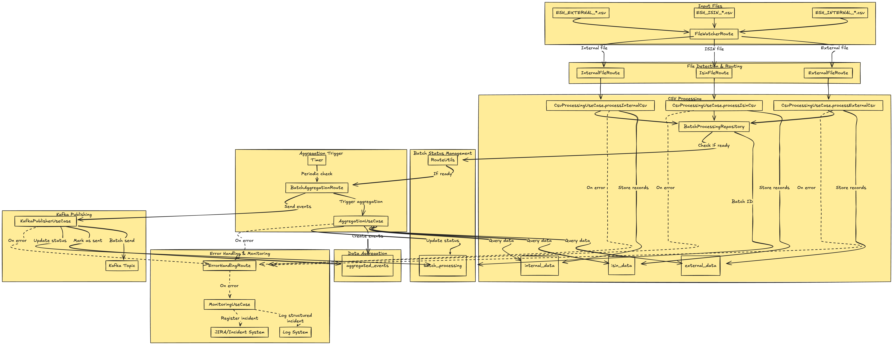

# quarkus-camel-kafka

**Overview**:

Our system processes three types of CSV files (external, ISIN, and Internal), aggregates the data based on correlation keys (so, we truly needs something to make relation) and sends the results to Kafka.

We've **FileWatcherRoute**: Basically, the purpose is monitors the input directory for new CSV files and routes them to the appropriate processor based on filename pattern. Extracts correlation ID (batch_id) from filenames, based on date and implements file locking to ensure only one thread processes each file. And use file component with idempotent processing to prevent duplicate processing.

**CsvProcessingUseCase**: Purpose to parses and validates CSV content, and creating entities for storage. So, there we can validates headers and file structure, converts CSV rows to domain entities, saves records to the database, updates batch status.

**BatchProcessingRepository**: It's the central component for tracking batch status, so, we can tracks which file types have been received for each batch, determines when a batch is ready for processing, and manages batch state transitions (PENDING -> PROCESSING > AGGREGATED > COMPLETED).

**RouteUtils**: Utility class that checks if a batch is ready for aggregation. So, queries batch status and trigger aggregation when all required files are received.

**BatchAggregationRoute**: Coordinates batch aggregation and Kafka Publishing, and implements a timer that periodically checks for ready batches and makes aggregated data to Kafka publishing.

**AggregationUseCase**: Core business logic for data aggregation, so, retrieve all data for a batch from all three tables, create correlation maps for efficient lookups, combine data from all sources based on correlation keys, and then creates aggregated events and stores them, in the end updates batch status too.

**KafkaPublisherUseCase**: Reliable delivery of aggregated events to Kafka.

**ErrorHandlingRoute**: Centralized error handling for Camel Routes, there we processes exception from all routes, determines appropriate handling based on exception type, moves files to error directory when appropriate and trigger incident creating and monitoring.

# Tables

csvprocessor=# SELECT * FROM batch_processing;
batch_id    | has_external | has_isin | has_internal | ready_for_processing | processing_status |         created_at         |        last_updated
----------------+--------------+----------+--------------+----------------------+-------------------+----------------------------+----------------------------
BATCH_20250430 | t            | t        | t            | t                    | COMPLETED         | 2025-04-01 19:58:22.326282 | 2025-04-01 20:21:44.070433

csvprocessor=# SELECT * FROM external_data;
id                  |    batch_id    | external_id |  external_name   | external_value | correlation_key |         created_at         |         file_name         | processed
--------------------------------------+----------------+-------------+------------------+----------------+-----------------+----------------------------+---------------------------+-----------
b86497a0-49d3-4706-a175-aea1920b0571 | BATCH_20250430 | EXT001      | External Asset 1 |        1000.50 | KEY001          | 2025-04-01 20:17:53.349084 | ESH_EXTERNAL_20250430.csv | t
c7d006e3-ae25-43b4-85b3-f8b1f27ee9ed | BATCH_20250430 | EXT002      | External Asset 2 |        2500.75 | KEY002          | 2025-04-01 20:17:53.353119 | ESH_EXTERNAL_20250430.csv | t
4941033a-49f4-4068-bf84-1cdfc7c9c587 | BATCH_20250430 | EXT003      | External Asset 3 |        3200.25 | KEY003          | 2025-04-01 20:17:53.354586 | ESH_EXTERNAL_20250430.csv | t
cb69087b-d09b-4f8d-83e7-6a2d6c546fce | BATCH_20250430 | EXT004      | External Asset 4 |        1800.90 | KEY004          | 2025-04-01 20:17:53.355761 | ESH_EXTERNAL_20250430.csv | t
51aed78a-64fe-4b1d-9203-b0d7727d45ec | BATCH_20250430 | EXT005      | External Asset 5 |        5000.00 | KEY005          | 2025-04-01 20:17:53.356975 | ESH_EXTERNAL_20250430.csv | t

csvprocessor=# SELECT * FROM isin_data;
id                  |    batch_id    |     isin     |   isin_description    | isin_category | correlation_key |         created_at         |       file_name       | processed
--------------------------------------+----------------+--------------+-----------------------+---------------+-----------------+----------------------------+-----------------------+-----------
26a90e08-fcb7-4e28-a9ad-9ac861b1c84a | BATCH_20250430 | US0378331005 | Apple Inc             | EQUITY        | KEY001          | 2025-04-01 20:21:17.8662   | ESH_ISIN_20250430.csv | t
d47398a2-a763-4ac2-9052-6b25960e4870 | BATCH_20250430 | US5949181045 | Microsoft Corporation | EQUITY        | KEY002          | 2025-04-01 20:21:17.866942 | ESH_ISIN_20250430.csv | t
de4e19d7-e77d-4a5e-969f-fdde1fae1221 | BATCH_20250430 | US0231351067 | Amazon.com Inc        | EQUITY        | KEY003          | 2025-04-01 20:21:17.866963 | ESH_ISIN_20250430.csv | t
b14bafc6-3bd4-4c9d-85e8-c98f25d94df0 | BATCH_20250430 | US02079K1079 | Alphabet Inc          | EQUITY        | KEY004          | 2025-04-01 20:21:17.866975 | ESH_ISIN_20250430.csv | t
520af485-4b4a-4006-9348-d0bacacd30d5 | BATCH_20250430 | US88160R1014 | Tesla Inc             | EQUITY        | KEY005          | 2025-04-01 20:21:17.866984 | ESH_ISIN_20250430.csv | t

csvprocessor=# SELECT * FROM internal_data;
id                  |    batch_id    | internal_id | internal_code | internal_amount | correlation_key |         created_at         |         file_name         | processed
--------------------------------------+----------------+-------------+---------------+-----------------+-----------------+----------------------------+---------------------------+-----------
5bad8626-f7fa-4b9f-a137-72d382335b26 | BATCH_20250430 | INT001      | APPL          |          950.25 | KEY001          | 2025-04-01 20:21:43.451309 | ESH_INTERNAL_20250430.csv | t
58ea47cb-e657-43af-aff0-f3abf8df2491 | BATCH_20250430 | INT002      | MSFT          |         2400.50 | KEY002          | 2025-04-01 20:21:43.452375 | ESH_INTERNAL_20250430.csv | t
13a41ed6-31f4-4812-874f-f25a7f93c797 | BATCH_20250430 | INT003      | AMZN          |         3100.75 | KEY003          | 2025-04-01 20:21:43.45239  | ESH_INTERNAL_20250430.csv | t
ab444145-8c81-4107-9343-da33f1980dc5 | BATCH_20250430 | INT004      | GOOG          |         1750.30 | KEY004          | 2025-04-01 20:21:43.452398 | ESH_INTERNAL_20250430.csv | t
e803902e-2d88-4742-8172-95f7de6bd997 | BATCH_20250430 | INT005      | TSLA          |         4800.90 | KEY005          | 2025-04-01 20:21:43.452406 | ESH_INTERNAL_20250430.csv | t

csvprocessor=# SELECT * FROM aggregated_events;
id                  |    batch_id    | correlation_key |                                                                                                                                                                           event_json                                                                                                                                                                           |         created_at         | sent_to_kafka |          sent_at
--------------------------------------+----------------+-----------------+----------------------------------------------------------------------------------------------------------------------------------------------------------------------------------------------------------------------------------------------------------------------------------------------------------------------------------------------------------------+----------------------------+---------------+---------------------------
a97e86ae-9162-4220-874c-3db106ca5fd9 | BATCH_20250430 | KEY001          | {"correlationId":"KEY001","timestamp":"2025-04-01T20:21:43.598047","externalData":{"externalId":"EXT001","externalName":"External Asset 1","externalValue":1000.5},"isinData":{"isin":"US0378331005","isinDescription":"Apple Inc","isinCategory":"EQUITY"},"internalData":{"internalId":"INT001","internalCode":"APPL","internalAmount":950.25}}              | 2025-04-01 20:21:43.600359 | t             | 2025-04-01 20:21:44.01232
fe3d6402-8381-4047-9b40-df62ca85b312 | BATCH_20250430 | KEY002          | {"correlationId":"KEY002","timestamp":"2025-04-01T20:21:43.640645","externalData":{"externalId":"EXT002","externalName":"External Asset 2","externalValue":2500.75},"isinData":{"isin":"US5949181045","isinDescription":"Microsoft Corporation","isinCategory":"EQUITY"},"internalData":{"internalId":"INT002","internalCode":"MSFT","internalAmount":2400.5}} | 2025-04-01 20:21:43.640701 | t             | 2025-04-01 20:21:44.01232
90138a3d-dccc-4712-9ad7-ca784254b133 | BATCH_20250430 | KEY003          | {"correlationId":"KEY003","timestamp":"2025-04-01T20:21:43.641025","externalData":{"externalId":"EXT003","externalName":"External Asset 3","externalValue":3200.25},"isinData":{"isin":"US0231351067","isinDescription":"Amazon.com Inc","isinCategory":"EQUITY"},"internalData":{"internalId":"INT003","internalCode":"AMZN","internalAmount":3100.75}}       | 2025-04-01 20:21:43.641035 | t             | 2025-04-01 20:21:44.01232
e2574adc-022d-4946-93ba-9aeb74171437 | BATCH_20250430 | KEY004          | {"correlationId":"KEY004","timestamp":"2025-04-01T20:21:43.641102","externalData":{"externalId":"EXT004","externalName":"External Asset 4","externalValue":1800.9},"isinData":{"isin":"US02079K1079","isinDescription":"Alphabet Inc","isinCategory":"EQUITY"},"internalData":{"internalId":"INT004","internalCode":"GOOG","internalAmount":1750.3}}           | 2025-04-01 20:21:43.641108 | t             | 2025-04-01 20:21:44.01232
9c25f7f4-7adf-4403-8d37-bf51dad4993d | BATCH_20250430 | KEY005          | {"correlationId":"KEY005","timestamp":"2025-04-01T20:21:43.641159","externalData":{"externalId":"EXT005","externalName":"External Asset 5","externalValue":5000.0},"isinData":{"isin":"US88160R1014","isinDescription":"Tesla Inc","isinCategory":"EQUITY"},"internalData":{"internalId":"INT005","internalCode":"TSLA","internalAmount":4800.9}}              | 2025-04-01 20:21:43.641166 | t             | 2025-04-01 20:21:44.01232

## Kafka Broker Message 

{"correlationId":"KEY001","timestamp":"2025-04-01T20:21:43.598047","externalData":{"externalId":"EXT001","externalName":"External Asset 1","externalValue":1000.5},"isinData":{"isin":"US0378331005","isinDescription":"Apple Inc","isinCategory":"EQUITY"},"internalData":{"internalId":"INT001","internalCode":"APPL","internalAmount":950.25}}
{"correlationId":"KEY002","timestamp":"2025-04-01T20:21:43.640645","externalData":{"externalId":"EXT002","externalName":"External Asset 2","externalValue":2500.75},"isinData":{"isin":"US5949181045","isinDescription":"Microsoft Corporation","isinCategory":"EQUITY"},"internalData":{"internalId":"INT002","internalCode":"MSFT","internalAmount":2400.5}}
{"correlationId":"KEY003","timestamp":"2025-04-01T20:21:43.641025","externalData":{"externalId":"EXT003","externalName":"External Asset 3","externalValue":3200.25},"isinData":{"isin":"US0231351067","isinDescription":"Amazon.com Inc","isinCategory":"EQUITY"},"internalData":{"internalId":"INT003","internalCode":"AMZN","internalAmount":3100.75}}
{"correlationId":"KEY004","timestamp":"2025-04-01T20:21:43.641102","externalData":{"externalId":"EXT004","externalName":"External Asset 4","externalValue":1800.9},"isinData":{"isin":"US02079K1079","isinDescription":"Alphabet Inc","isinCategory":"EQUITY"},"internalData":{"internalId":"INT004","internalCode":"GOOG","internalAmount":1750.3}}
{"correlationId":"KEY005","timestamp":"2025-04-01T20:21:43.641159","externalData":{"externalId":"EXT005","externalName":"External Asset 5","externalValue":5000.0},"isinData":{"isin":"US88160R1014","isinDescription":"Tesla Inc","isinCategory":"EQUITY"},"internalData":{"internalId":"INT005","internalCode":"TSLA","internalAmount":4800.9}}